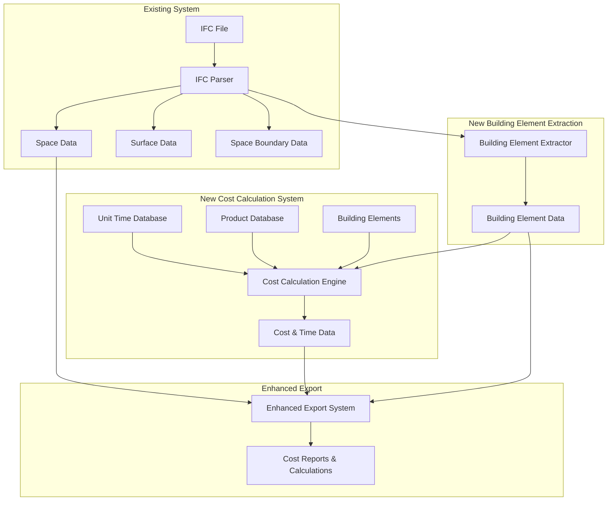

# Design Document

## Overview

Enhetstider og produktmapping-funksjonen utvider den eksisterende IFC Room Schedule-applikasjonen med omfattende kostnads- og tidsberegningskapasiteter. Systemet vil kunne importere enhetstider og produktdata, mappe disse til alle IFC building element-entiteter, og automatisk beregne kostnader og arbeidstimer basert på faktiske mengder fra 3D-modellen.

Designet bygger på den eksisterende arkitekturen med parser-, data- og export-moduler, og legger til nye moduler for kostnadsberegning og mapping-funksjonalitet.

## Architecture

### High-Level Architecture



### Module Structure

```
ifc_room_schedule/
├── parser/
│   ├── ifc_building_element_extractor.py  # NEW
│   └── ... (existing parsers)
├── data/
│   ├── building_element_model.py          # NEW
│   ├── unit_time_model.py                 # NEW
│   ├── product_model.py                   # NEW
│   ├── cost_calculation_model.py          # NEW
│   └── ... (existing models)
├── cost/                                  # NEW MODULE
│   ├── __init__.py
│   ├── unit_time_importer.py
│   ├── product_importer.py
│   ├── mapping_engine.py
│   ├── cost_calculator.py
│   └── validation_engine.py
├── export/
│   ├── cost_report_exporter.py            # NEW
│   └── ... (existing exporters)
└── ui/
    ├── cost_mapping_widget.py             # NEW
    └── ... (existing UI components)
```

## Components and Interfaces

### 1. Building Element Extractor

**Purpose**: Ekstraherer alle IFC building element-entiteter fra IFC-filer.

**Key Classes**:
- `IfcBuildingElementExtractor`: Hovedklasse for ekstraksjon av building elements
- `BuildingElementData`: Datamodell for building element-informasjon

**Interface**:
```python
class IfcBuildingElementExtractor:
    def extract_building_elements(self, ifc_file) -> List[BuildingElementData]
    def extract_element_quantities(self, element) -> Dict[str, float]
    def extract_element_materials(self, element) -> List[MaterialData]
    def get_elements_by_type(self, element_type: str) -> List[BuildingElementData]
```

### 2. Unit Time Management

**Purpose**: Håndterer import og lagring av enhetstider for forskjellige arbeidsoperasjoner.

**Key Classes**:
- `UnitTimeImporter`: Importerer enhetstider fra forskjellige filformater
- `UnitTimeData`: Datamodell for enhetstider
- `WorkOperationData`: Datamodell for arbeidsoperasjoner

**Interface**:
```python
class UnitTimeImporter:
    def import_from_json(self, file_path: str) -> List[UnitTimeData]
    def import_from_csv(self, file_path: str) -> List[UnitTimeData]
    def import_from_excel(self, file_path: str) -> List[UnitTimeData]
    def validate_unit_times(self, unit_times: List[UnitTimeData]) -> ValidationResult
```

### 3. Product Management

**Purpose**: Håndterer import og lagring av produktdata med priser og spesifikasjoner.

**Key Classes**:
- `ProductImporter`: Importerer produktdata fra forskjellige kilder
- `ProductData`: Datamodell for produkter
- `ProductCatalog`: Katalog over tilgjengelige produkter

**Interface**:
```python
class ProductImporter:
    def import_from_json(self, file_path: str) -> List[ProductData]
    def import_from_csv(self, file_path: str) -> List[ProductData]
    def import_from_excel(self, file_path: str) -> List[ProductData]
    def validate_products(self, products: List[ProductData]) -> ValidationResult
```

### 4. Mapping Engine

**Purpose**: Håndterer mapping mellom building elements og enhetstider/produkter.

**Key Classes**:
- `MappingEngine`: Hovedklasse for mapping-funksjonalitet
- `ElementMapping`: Datamodell for mapping-relasjoner
- `MappingRule`: Regler for automatisk mapping

**Interface**:
```python
class MappingEngine:
    def create_mapping(self, element_guid: str, unit_time_id: str, product_id: str) -> ElementMapping
    def get_mappings_for_element(self, element_guid: str) -> List[ElementMapping]
    def apply_automatic_mapping_rules(self, elements: List[BuildingElementData]) -> List[ElementMapping]
    def validate_mappings(self, mappings: List[ElementMapping]) -> ValidationResult
```

### 5. Cost Calculator

**Purpose**: Beregner kostnader og arbeidstimer basert på mapping og mengder.

**Key Classes**:
- `CostCalculator`: Hovedklasse for kostnadsberegninger
- `CostCalculationResult`: Resultat av kostnadsberegninger
- `TimeCalculationResult`: Resultat av tidsberegninger

**Interface**:
```python
class CostCalculator:
    def calculate_element_cost(self, element: BuildingElementData, mapping: ElementMapping) -> CostCalculationResult
    def calculate_element_time(self, element: BuildingElementData, mapping: ElementMapping) -> TimeCalculationResult
    def calculate_project_totals(self, elements: List[BuildingElementData]) -> ProjectCalculationResult
    def recalculate_on_quantity_change(self, element_guid: str, new_quantities: Dict[str, float]) -> None
```

## Data Models

### BuildingElementData

```python
@dataclass
class BuildingElementData:
    guid: str
    name: str
    description: str
    ifc_type: str  # IfcWall, IfcSlab, etc.
    quantities: Dict[str, float]  # NetVolume, GrossVolume, NetArea, etc.
    materials: List[MaterialData]
    properties: Dict[str, Any]
    storey_guid: str
    building_guid: str
    site_guid: str
    mappings: List[ElementMapping] = field(default_factory=list)
```

### UnitTimeData

```python
@dataclass
class UnitTimeData:
    id: str
    operation_name: str
    description: str
    unit_time: float  # timer per enhet
    unit: str  # m², m³, stk, m
    category: str
    applicable_element_types: List[str]  # IfcWall, IfcSlab, etc.
    skill_level: str
    equipment_required: List[str]
```

### ProductData

```python
@dataclass
class ProductData:
    id: str
    name: str
    description: str
    price: float
    unit: str  # NOK/m², NOK/m³, NOK/stk
    category: str
    supplier: str
    applicable_element_types: List[str]
    material_properties: Dict[str, Any]
    environmental_data: Dict[str, Any]
```

### ElementMapping

```python
@dataclass
class ElementMapping:
    id: str
    element_guid: str
    unit_time_id: Optional[str]
    product_id: Optional[str]
    quantity_override: Optional[Dict[str, float]]
    custom_factors: Dict[str, float]  # For adjustments
    created_date: datetime
    last_modified: datetime
```

### CostCalculationResult

```python
@dataclass
class CostCalculationResult:
    element_guid: str
    total_material_cost: float
    total_labor_cost: float
    total_cost: float
    cost_per_unit: Dict[str, float]  # Cost per m², m³, etc.
    cost_breakdown: Dict[str, float]
    currency: str = "NOK"
```

## Error Handling

### Import Error Handling

- **File Format Validation**: Validerer filformater før import
- **Data Validation**: Sjekker dataintegritet og konsistens
- **Partial Import Support**: Fortsetter med gyldige data ved feil
- **Error Reporting**: Detaljerte feilrapporter med linjenummer og årsak

### Calculation Error Handling

- **Missing Data Handling**: Håndterer manglende enhetstider eller produktdata
- **Quantity Validation**: Validerer at nødvendige mengder er tilgjengelige
- **Overflow Protection**: Beskytter mot urimelig store beregninger
- **Precision Handling**: Håndterer avrundingsfeil i beregninger

### Mapping Error Handling

- **Conflict Resolution**: Håndterer konflikter i mapping-regler
- **Orphaned Mapping Detection**: Finner mapping uten tilhørende elementer
- **Circular Dependency Detection**: Forhindrer sirkulære avhengigheter
- **Version Compatibility**: Håndterer endringer i IFC-data

## Testing Strategy

### Unit Testing

- **Parser Testing**: Test av building element-ekstraksjon
- **Import Testing**: Test av enhetstid- og produktimport
- **Calculation Testing**: Test av kostnads- og tidsberegninger
- **Mapping Testing**: Test av mapping-funksjonalitet
- **Validation Testing**: Test av valideringslogikk

### Integration Testing

- **End-to-End Workflow**: Test av komplett arbeidsflyt fra IFC til rapport
- **Data Consistency**: Test av datakonsistens mellom moduler
- **Performance Testing**: Test av ytelse med store datasett
- **Error Recovery**: Test av feilhåndtering og gjenoppretting

### Test Data

- **Sample IFC Files**: Testfiler med forskjellige building element-typer
- **Unit Time Databases**: Testdata for enhetstider
- **Product Catalogs**: Testdata for produkter
- **Expected Results**: Forventede resultater for validering

### Automated Testing

- **Continuous Integration**: Automatisk testing ved kodeendringer
- **Regression Testing**: Test av eksisterende funksjonalitet
- **Performance Benchmarks**: Automatisk ytelsestesting
- **Data Validation**: Automatisk validering av testdata

## Implementation Considerations

### Performance Optimization

- **Lazy Loading**: Last building elements kun når nødvendig
- **Caching Strategy**: Cache beregninger for gjenbruk
- **Batch Processing**: Prosesser flere elementer samtidig
- **Memory Management**: Effektiv minnehåndtering for store prosjekter

### Scalability

- **Database Integration**: Støtte for eksterne databaser
- **Distributed Processing**: Mulighet for distribuert beregning
- **API Integration**: Integrasjon med eksterne kostnadsdata-APIer
- **Cloud Storage**: Støtte for sky-basert lagring

### User Experience

- **Progressive Disclosure**: Vis kompleksitet gradvis
- **Real-time Feedback**: Umiddelbar tilbakemelding på endringer
- **Undo/Redo Support**: Støtte for angre/gjenta operasjoner
- **Keyboard Shortcuts**: Effektive tastatursnarveier

### Data Security

- **Input Validation**: Validering av all brukerinput
- **Access Control**: Kontroll av tilgang til sensitive data
- **Audit Trail**: Logging av alle endringer
- **Data Encryption**: Kryptering av sensitive kostnadsdata