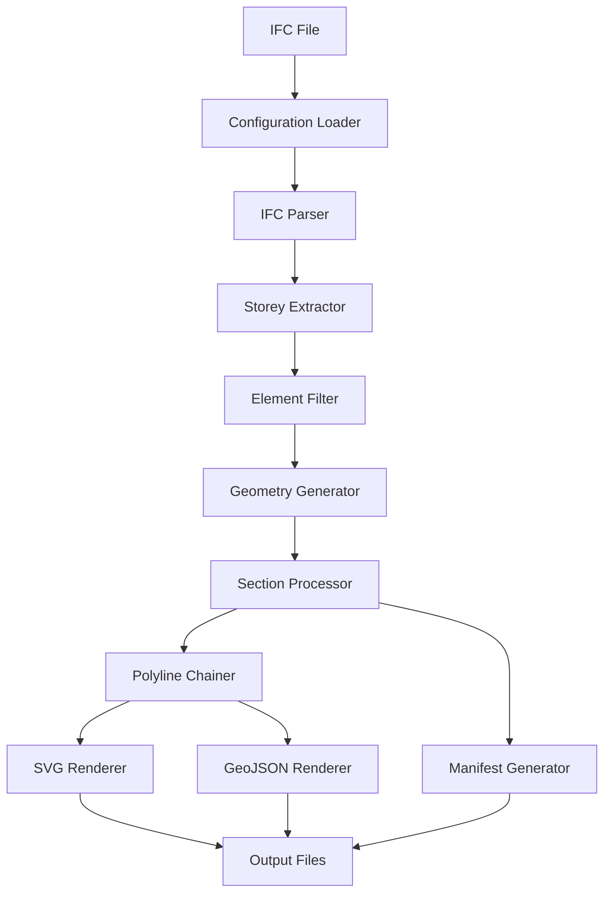

# Design Document

## Overview

IFC Floor Plan Generator er et system som konverterer IFC (Industry Foundation Classes) filer til 2D planview representasjoner i SVG og GeoJSON format. Systemet bruker IfcOpenShell for IFC-parsing og geometrigenerering, og implementerer konfigurerbar snitt-logikk for å generere horisontale snitt på spesifiserte høyder per etasje.

Arkitekturen følger en pipeline-basert tilnærming hvor IFC-data prosesseres gjennom flere steg: parsing, filtrering, geometrigenerering, snitt-operasjoner, og til slutt rendering til output-formater.

## Architecture

### High-Level Architecture

```
IFC File Input → Configuration → IFC Parser → Geometry Generator → Section Processor → Renderer → Output (SVG/GeoJSON/Manifest)
```

### Core Components

1. **Configuration Manager** - Håndterer JSON-basert konfigurasjon og validering
2. **IFC Parser** - Wrapper rundt IfcOpenShell for IFC-fil lesing og element-ekstraksjon
3. **Geometry Engine** - Genererer 3D geometri fra IFC-elementer med konfigurerbare innstillinger
4. **Section Processor** - Utfører horisontale snitt og konverterer til 2D polylinjer
5. **Renderer** - Genererer SVG og GeoJSON output med styling
6. **Error Handler** - Sentralisert feilhåndtering med norske feilmeldinger
7. **Performance Manager** - Håndterer multiprocessing og caching

### System Flow



## Components and Interfaces

### 1. Configuration Manager

**Purpose:** Håndterer loading, validering og tilgang til konfigurasjon.

**Interface:**
```python
class ConfigurationManager:
    def load_config(self, config_path: str) -> Config
    def validate_config(self, config: dict) -> bool
    def get_storey_cut_height(self, storey_name: str) -> float
    def get_class_filters(self) -> ClassFilters
    def get_rendering_style(self, ifc_class: str) -> RenderStyle
```

**Key Responsibilities:**
- JSON schema validering mot config-schema.json
- Håndtering av per_storey_overrides
- Tilgang til class_filters og styling-konfigurasjon
- Enhetskonvertering og skalering

### 2. IFC Parser

**Purpose:** Wrapper rundt IfcOpenShell for robust IFC-fil håndtering.

**Interface:**
```python
class IFCParser:
    def open_file(self, file_path: str) -> IfcFile
    def extract_storeys(self, ifc_file: IfcFile) -> List[IfcBuildingStorey]
    def get_elements_by_storey(self, storey: IfcBuildingStorey) -> List[IfcElement]
    def detect_units(self, ifc_file: IfcFile) -> float
```

**Error Handling:**
- IFC_OPEN_FAILED for fil-åpning problemer
- NO_STOREYS_FOUND når ingen IfcBuildingStorey finnes
- Robust håndtering av korrupte eller ufullstendige IFC-filer

### 3. Geometry Engine

**Purpose:** Genererer 3D geometri fra IFC-elementer med konfigurerbare innstillinger.

**Interface:**
```python
class GeometryEngine:
    def __init__(self, config: GeometryConfig)
    def generate_shape(self, element: IfcElement) -> TopoDS_Shape
    def get_element_bounds(self, shape: TopoDS_Shape) -> BoundingBox
    def cache_geometry(self, guid: str, shape: TopoDS_Shape) -> None
```

**Configuration Options:**
- use_world_coords: Bruk globale vs lokale koordinater
- subtract_openings: Trekk fra åpninger fra parent-elementer
- sew_shells: Søm skall for renere geometri

**Caching Strategy:**
- GUID-basert caching for gjenbruk av geometri
- Memory-efficient storage med optional disk-backing
- Cache invalidation ved konfigurasjon-endringer

### 4. Section Processor

**Purpose:** Utfører horisontale snitt og konverterer til 2D polylinjer.

**Interface:**
```python
class SectionProcessor:
    def create_section_plane(self, z_height: float) -> gp_Pln
    def intersect_shape_with_plane(self, shape: TopoDS_Shape, plane: gp_Pln) -> List[TopoDS_Edge]
    def edges_to_polylines(self, edges: List[TopoDS_Edge]) -> List[Polyline2D]
    def chain_polylines(self, polylines: List[Polyline2D], tolerance: float) -> List[Polyline2D]
```

**Algorithm Details:**
- Bruker OpenCASCADE BRepAlgoAPI_Section for snitt-operasjoner
- Implementerer polyline chaining med konfigurerbar toleranse
- Håndterer edge cases som tangente snitt og degenererte geometrier

### 5. Renderer

**Purpose:** Genererer SVG og GeoJSON output med konfigurerbar styling.

**SVG Renderer Interface:**
```python
class SVGRenderer:
    def __init__(self, config: RenderingConfig)
    def render_polylines(self, polylines: List[Polyline2D], metadata: Dict) -> str
    def apply_styling(self, ifc_class: str) -> StyleAttributes
    def set_viewport(self, bounds: BoundingBox) -> None
```

**GeoJSON Renderer Interface:**
```python
class GeoJSONRenderer:
    def render_polylines(self, polylines: List[Polyline2D], metadata: Dict) -> Dict
    def create_feature_properties(self, ifc_class: str, storey_name: str) -> Dict
    def add_semantic_metadata(self, properties: Dict) -> Dict
```

**Styling Features:**
- Per-class color og linewidth override
- Coordinate system transformation (invert_y)
- Background color support
- Viewport auto-scaling

### 6. Error Handler

**Purpose:** Sentralisert feilhåndtering med strukturerte feilkoder og norske meldinger.

**Interface:**
```python
class ErrorHandler:
    def handle_error(self, error_code: str, context: Dict = None) -> ProcessingError
    def log_warning(self, message: str, context: Dict = None) -> None
    def get_error_message(self, error_code: str) -> str
```

**Error Codes (fra errors.json):**
- IFC_OPEN_FAILED: IFC-fil kan ikke åpnes
- NO_STOREYS_FOUND: Ingen IfcBuildingStorey funnet
- EMPTY_CUT_RESULT: Snitt ga ingen segmenter
- GEOMETRY_SHAPE_FAILED: Shape-generering feilet
- WRITE_FAILED: Output-skriving feilet

## Data Models

### Core Data Structures

```python
@dataclass
class Config:
    input_path: str
    output_dir: str
    cut_offset_m: float
    per_storey_overrides: Dict[str, StoreyConfig]
    class_filters: ClassFilters
    units: UnitsConfig
    geometry: GeometryConfig
    tolerances: TolerancesConfig
    rendering: RenderingConfig
    output: OutputConfig
    performance: PerformanceConfig

@dataclass
class Polyline2D:
    points: List[Tuple[float, float]]
    ifc_class: str
    element_guid: str
    is_closed: bool

@dataclass
class StoreyResult:
    storey_name: str
    polylines: List[Polyline2D]
    bounds: BoundingBox
    cut_height: float
    element_count: int

@dataclass
class ProcessingResult:
    storeys: List[StoreyResult]
    manifest: ManifestData
    errors: List[ProcessingError]
    warnings: List[str]
```

### File Output Structures

**Manifest JSON:**
```json
{
  "input_file": "path/to/input.ifc",
  "generated_at": "2024-01-01T12:00:00Z",
  "storeys": [
    {
      "name": "Plan 01",
      "svg_file": "01_plan_01.svg",
      "geojson_file": "01_plan_01.geo.json",
      "cut_height": 1.05,
      "bounds": {"min_x": 0, "min_y": 0, "max_x": 100, "max_y": 50},
      "element_count": 245
    }
  ],
  "config_used": { /* snapshot of config */ }
}
```

## Error Handling

### Error Classification

1. **Critical Errors** - Stopper prosessering helt
   - IFC_OPEN_FAILED
   - NO_STOREYS_FOUND
   - WRITE_FAILED (for manifest)

2. **Per-Storey Errors** - Påvirker kun en etasje
   - EMPTY_CUT_RESULT
   - GEOMETRY_SHAPE_FAILED (for hele etasje)

3. **Element-Level Errors** - Påvirker kun enkelte elementer
   - GEOMETRY_SHAPE_FAILED (for enkelt element)

### Error Recovery Strategies

- **Graceful Degradation:** Fortsett prosessering av andre etasjer ved per-storey feil
- **Element Skipping:** Hopp over problematiske elementer og logg advarsler
- **Fallback Values:** Bruk default-verdier ved konfigurasjon-problemer
- **Retry Logic:** Forsøk alternative geometri-innstillinger ved shape-feil

### Logging Strategy

```python
# Strukturert logging med kontekst
logger.error("GEOMETRY_SHAPE_FAILED", extra={
    "element_guid": element.GlobalId,
    "ifc_class": element.is_a(),
    "storey": storey_name,
    "suggested_action": "Sjekk representasjoner og åpningsinnstillinger"
})
```

## Testing Strategy

### Unit Testing

**Configuration Manager Tests:**
- JSON schema validering
- Per-storey override logikk
- Enhetskonvertering og skalering
- Feilhåndtering for ugyldig konfigurasjon

**IFC Parser Tests:**
- Mock IFC-filer med kjente strukturer
- Feilhåndtering for korrupte filer
- Enhetsdeteksjon for forskjellige IFC-versjoner
- Storey-ekstraksjon edge cases

**Geometry Engine Tests:**
- Shape-generering for standard IFC-elementer
- Åpnings-subtraksjon logikk
- Caching-funksjonalitet
- Performance med store geometrier

**Section Processor Tests:**
- Snitt-operasjoner med kjente geometrier
- Polyline chaining algoritmer
- Toleranse-håndtering
- Edge cases (tangente snitt, degenererte geometrier)

**Renderer Tests:**
- SVG output validering
- GeoJSON format compliance
- Styling application
- Coordinate transformation

### Integration Testing

**End-to-End Pipeline Tests:**
- Komplette IFC-filer fra forskjellige kilder
- Forskjellige konfigurasjon-kombinasjoner
- Performance testing med store filer
- Output-kvalitet validering

**Error Handling Integration:**
- Simulerte fil-system feil
- Korrupte IFC-input
- Minnebegrensning scenarios
- Multiprocessing error propagation

### Performance Testing

**Benchmarking:**
- Processing time vs IFC file size
- Memory usage profiling
- Multiprocessing scaling efficiency
- Cache hit rate optimization

**Load Testing:**
- Batch processing av multiple filer
- Concurrent processing scenarios
- Resource exhaustion handling
- Long-running stability

### Test Data Strategy

**Synthetic IFC Files:**
- Minimal valid IFC med kjente geometrier
- Edge case geometrier (overlapping, self-intersecting)
- Forskjellige enhets-systemer
- Varierende kompleksitet (element count, nesting depth)

**Real-World Samples:**
- Anonymiserte IFC-filer fra forskjellige kilder
- Forskjellige IFC-versjoner (2x3, 4)
- Varierende software-opprinnelse (Revit, ArchiCAD, etc.)
- Forskjellige bygningstyper og størrelser