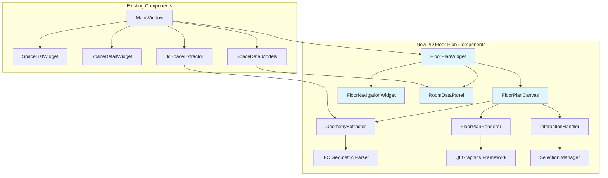

# Design Document

## Overview

The Interactive 2D Floor Plans feature will extend the existing IFC Room Schedule application with visual floor plan capabilities. The feature will integrate seamlessly with the current PyQt6-based architecture, leveraging existing data models and parsers while adding new components for geometric data extraction, 2D rendering, and interactive visualization.

The design follows the existing application patterns with separate UI components, data models, and processing modules. The feature will use Qt's graphics framework for 2D rendering and maintain the current error handling and threading patterns established in the application.

## Architecture

### High-Level Architecture



### Integration Points

The new floor plan feature will integrate with existing components at these key points:

1. **MainWindow Integration**: New floor plan tab/widget alongside existing space list
2. **Data Model Reuse**: Leverage existing SpaceData, SurfaceData models
3. **IFC Parser Extension**: Extend existing parsers to extract geometric data
4. **Export Integration**: Include floor plan selections in existing export functionality

## Components and Interfaces

### 1. FloorPlanWidget (Main Container)

**Purpose**: Main container widget that orchestrates the floor plan interface

**Key Responsibilities**:
- Manage layout between floor plan canvas, navigation, and data panel
- Coordinate communication between sub-components
- Handle floor switching and data loading
- Integrate with existing MainWindow

**Interface**:
```python
class FloorPlanWidget(QWidget):
    # Signals
    room_selected = pyqtSignal(str)  # room GUID
    rooms_selected = pyqtSignal(list)  # list of room GUIDs
    floor_changed = pyqtSignal(str)  # floor identifier
    
    # Methods
    def load_floor_data(self, spaces: List[SpaceData]) -> None
    def set_selected_rooms(self, room_guids: List[str]) -> None
    def get_selected_rooms(self) -> List[str]
    def switch_floor(self, floor_id: str) -> None
    def export_selected_rooms(self) -> List[SpaceData]
```

### 2. GeometryExtractor (Data Processing)

**Purpose**: Extract 2D geometric data from IFC files for floor plan rendering

**Key Responsibilities**:
- Parse IFC geometric entities (IfcSpace, IfcWall, IfcSlab)
- Extract 2D footprints and boundaries
- Group spaces by building level/floor
- Convert 3D coordinates to 2D floor plan coordinates

**Interface**:
```python
class GeometryExtractor:
    def extract_floor_geometry(self, ifc_file) -> Dict[str, FloorGeometry]
    def extract_space_boundaries(self, ifc_space) -> List[Polygon2D]
    def get_floor_levels(self, ifc_file) -> List[FloorLevel]
    def convert_to_2d_coordinates(self, geometry_3d) -> Polygon2D
```

**Data Structures**:
```python
@dataclass
class Point2D:
    x: float
    y: float

@dataclass
class Polygon2D:
    points: List[Point2D]
    space_guid: str
    space_name: str

@dataclass
class FloorLevel:
    id: str
    name: str
    elevation: float
    spaces: List[str]  # space GUIDs

@dataclass
class FloorGeometry:
    level: FloorLevel
    room_polygons: List[Polygon2D]
    building_outline: Optional[Polygon2D]
    bounds: Tuple[float, float, float, float]  # min_x, min_y, max_x, max_y
```

### 3. FloorPlanCanvas (Rendering & Interaction)

**Purpose**: Custom Qt widget for rendering 2D floor plans and handling user interactions

**Key Responsibilities**:
- Render floor plan geometry using Qt's QPainter
- Handle mouse events for room selection and navigation
- Manage zoom, pan, and view transformations
- Provide visual feedback for selections and highlighting

**Interface**:
```python
class FloorPlanCanvas(QWidget):
    # Signals
    room_clicked = pyqtSignal(str, bool)  # room_guid, ctrl_pressed
    rooms_selection_changed = pyqtSignal(list)  # selected room GUIDs
    view_changed = pyqtSignal(QRectF)  # visible area
    
    # Methods
    def set_floor_geometry(self, geometry: FloorGeometry) -> None
    def highlight_rooms(self, room_guids: List[str]) -> None
    def clear_selection(self) -> None
    def zoom_to_fit(self) -> None
    def zoom_to_rooms(self, room_guids: List[str]) -> None
```

**Rendering Strategy**:
- Use QPainter for 2D graphics rendering
- Implement view transformation matrix for zoom/pan
- Layer-based rendering: background → room boundaries → highlights → labels
- Efficient redraw using Qt's update regions

### 4. RoomDataPanel (Data Display)

**Purpose**: Display room data alongside floor plan with interactive selection

**Key Responsibilities**:
- Show room list with key properties (name, area, type)
- Support multi-selection synchronized with floor plan
- Provide search and filtering capabilities
- Display detailed information for selected rooms

**Interface**:
```python
class RoomDataPanel(QWidget):
    # Signals
    room_selected_from_list = pyqtSignal(str, bool)  # room_guid, ctrl_pressed
    rooms_filtered = pyqtSignal(list)  # filtered room GUIDs
    
    # Methods
    def set_room_data(self, spaces: List[SpaceData]) -> None
    def highlight_rooms_in_list(self, room_guids: List[str]) -> None
    def get_selected_rooms(self) -> List[str]
    def show_room_details(self, room_guids: List[str]) -> None
```

### 5. FloorNavigationWidget (Navigation Controls)

**Purpose**: Provide navigation controls for multi-floor buildings

**Key Responsibilities**:
- Display available floors/levels
- Handle floor switching
- Show current floor context
- Provide floor-specific statistics

**Interface**:
```python
class FloorNavigationWidget(QWidget):
    # Signals
    floor_selected = pyqtSignal(str)  # floor_id
    
    # Methods
    def set_available_floors(self, floors: List[FloorLevel]) -> None
    def set_current_floor(self, floor_id: str) -> None
    def update_floor_statistics(self, floor_id: str, stats: Dict[str, Any]) -> None
```

### 6. SelectionManager (State Management)

**Purpose**: Manage room selection state across components

**Key Responsibilities**:
- Maintain current selection state
- Handle multi-selection logic
- Coordinate selection between floor plan and data panel
- Persist selection across floor changes

**Interface**:
```python
class SelectionManager:
    def add_room_to_selection(self, room_guid: str) -> None
    def remove_room_from_selection(self, room_guid: str) -> None
    def toggle_room_selection(self, room_guid: str) -> None
    def clear_selection(self) -> None
    def get_selected_rooms(self) -> List[str]
    def set_selection(self, room_guids: List[str]) -> None
```

## Data Models

### Extended Space Data Model

Extend existing SpaceData model to include geometric information:

```python
@dataclass
class SpaceData:
    # ... existing fields ...
    
    # New geometric fields
    floor_level_id: Optional[str] = None
    geometry_2d: Optional[Polygon2D] = None
    centroid_2d: Optional[Point2D] = None
    has_geometry: bool = False
```

### Floor Plan State Model

```python
@dataclass
class FloorPlanState:
    current_floor_id: Optional[str] = None
    selected_rooms: List[str] = field(default_factory=list)
    view_bounds: Optional[QRectF] = None
    zoom_level: float = 1.0
    available_floors: List[FloorLevel] = field(default_factory=list)
    geometry_data: Dict[str, FloorGeometry] = field(default_factory=dict)
```

## Error Handling

### Geometric Data Extraction Errors

**Strategy**: Graceful degradation with informative feedback

**Error Types**:
1. **No Geometric Data**: Show message, fall back to tabular view
2. **Partial Geometric Data**: Render available rooms, indicate missing ones
3. **Invalid Coordinates**: Skip invalid rooms, log warnings
4. **Memory Issues**: Implement progressive loading for large files

**Implementation**:
```python
class GeometryExtractionError(Exception):
    def __init__(self, message: str, error_type: str, affected_spaces: List[str] = None):
        super().__init__(message)
        self.error_type = error_type
        self.affected_spaces = affected_spaces or []

# Error handling in GeometryExtractor
def extract_floor_geometry(self, ifc_file) -> Dict[str, FloorGeometry]:
    try:
        # Extraction logic
        pass
    except MemoryError as e:
        raise GeometryExtractionError(
            "Insufficient memory for geometry extraction",
            "memory_error"
        )
    except Exception as e:
        raise GeometryExtractionError(
            f"Failed to extract geometry: {str(e)}",
            "extraction_error"
        )
```

### Rendering Performance Issues

**Strategy**: Progressive rendering and level-of-detail

**Techniques**:
1. **Viewport Culling**: Only render visible rooms
2. **Level of Detail**: Simplify geometry at low zoom levels
3. **Caching**: Cache rendered elements
4. **Background Loading**: Load geometry in background threads

### User Interaction Errors

**Strategy**: Robust event handling with user feedback

**Error Scenarios**:
1. **Invalid Room Selection**: Ignore invalid selections, maintain valid state
2. **Floor Switch Failures**: Show error, maintain current floor
3. **Export Failures**: Show detailed error, allow retry

## Testing Strategy

### Unit Testing

**Components to Test**:
1. **GeometryExtractor**: Test coordinate conversion, boundary extraction
2. **SelectionManager**: Test multi-selection logic, state management
3. **Data Models**: Test geometric data validation, serialization

**Test Data**:
- Create minimal IFC files with known geometric data
- Mock geometric data for consistent testing
- Test edge cases (empty floors, invalid coordinates)

### Integration Testing

**Scenarios**:
1. **End-to-End Workflow**: Load IFC → Extract geometry → Render → Interact
2. **Multi-Floor Navigation**: Switch between floors, maintain selections
3. **Export Integration**: Select rooms in floor plan, export data

### UI Testing

**Interaction Testing**:
1. **Mouse Events**: Click selection, Ctrl+click multi-selection, drag panning
2. **Keyboard Shortcuts**: Zoom controls, selection shortcuts
3. **Responsive Layout**: Test different window sizes, panel arrangements

### Performance Testing

**Scenarios**:
1. **Large Files**: Test with files containing 1000+ spaces
2. **Complex Geometry**: Test with detailed architectural models
3. **Memory Usage**: Monitor memory consumption during rendering

## Implementation Phases

### Phase 1: Core Geometry Extraction
- Implement GeometryExtractor class
- Create basic 2D data models
- Add geometric data to existing SpaceData model
- Unit tests for geometry extraction

### Phase 2: Basic Floor Plan Rendering
- Implement FloorPlanCanvas with basic rendering
- Add zoom and pan functionality
- Create simple room boundary visualization
- Basic mouse interaction for room selection

### Phase 3: Multi-Selection and Data Panel
- Implement SelectionManager
- Create RoomDataPanel with synchronized selection
- Add Ctrl+click multi-selection support
- Implement selection highlighting

### Phase 4: Multi-Floor Navigation
- Implement FloorNavigationWidget
- Add floor switching functionality
- Handle selection persistence across floors
- Floor-specific statistics and context

### Phase 5: Integration and Polish
- Integrate with MainWindow and existing UI
- Connect to export functionality
- Add keyboard shortcuts and accessibility
- Performance optimization and error handling

### Phase 6: Advanced Features
- Search and filtering in data panel
- Room labeling and annotations
- Export floor plan as image
- Advanced selection tools (area selection, filter-based selection)

## Dependencies

### New Dependencies
- **Qt Graphics**: Already available in PyQt6
- **Geometric Libraries**: Consider shapely for advanced geometric operations
- **Image Export**: QPainter can export to various formats

### Existing Dependencies
- **PyQt6**: UI framework (already used)
- **IfcOpenShell**: IFC file parsing (already used)
- **Existing Data Models**: SpaceData, SurfaceData (already implemented)

## Performance Considerations

### Memory Management
- **Lazy Loading**: Load geometry data only when needed
- **Data Caching**: Cache rendered elements, clear when not needed
- **Progressive Loading**: Load floors incrementally for large buildings

### Rendering Optimization
- **Viewport Culling**: Only render visible elements
- **Level of Detail**: Simplify rendering at different zoom levels
- **Update Regions**: Use Qt's efficient update regions for partial redraws

### User Experience
- **Responsive UI**: Keep UI responsive during geometry extraction
- **Progress Feedback**: Show progress for long operations
- **Graceful Degradation**: Fall back to existing functionality if geometry unavailable

## Security and Validation

### Input Validation
- **Coordinate Validation**: Ensure geometric coordinates are valid numbers
- **Boundary Validation**: Validate polygon boundaries are closed and valid
- **Selection Validation**: Ensure selected room GUIDs exist in current data

### Error Recovery
- **Malformed Geometry**: Skip invalid geometric data, continue with valid data
- **Missing References**: Handle missing space references gracefully
- **Corrupted Data**: Detect and recover from corrupted geometric data

This design provides a comprehensive foundation for implementing the interactive 2D floor plan feature while maintaining compatibility with the existing application architecture and following established patterns for error handling, threading, and user experience.