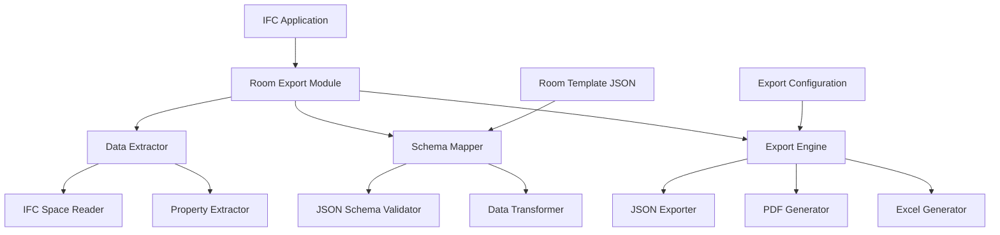

# Design Document

## Overview

The room schedule export system is designed as a module within an existing IFC-based application that extracts room data from IFC Spaces and exports it to structured room schedule formats. The system uses the comprehensive JSON template as the target schema and supports multiple export formats including JSON, PDF, and Excel.

## Architecture

### High-Level Architecture



### Component Responsibilities

- **Data Extractor**: Reads IFC Space data and extracts all available properties
- **Schema Mapper**: Maps IFC data to the room schedule JSON schema
- **Export Engine**: Generates output files in requested formats
- **Configuration Manager**: Handles user preferences for export settings

## Components and Interfaces

### 1. IFC Space Data Extractor

**Purpose**: Extract all relevant data from IFC Space entities

**Interface**:
```typescript
interface IFCSpaceExtractor {
  extractSpaceData(spaceGuid: string): RawSpaceData;
  extractGeometry(spaceGuid: string): GeometryData;
  extractProperties(spaceGuid: string): PropertySet[];
  extractRelatedElements(spaceGuid: string): RelatedElement[];
}

interface RawSpaceData {
  guid: string;
  name: string;
  longName: string;
  number: string;
  geometry: GeometryData;
  properties: PropertySet[];
  relatedElements: RelatedElement[];
  parentBuilding: string;
  parentStorey: string;
}
```

### 2. Room Schema Mapper

**Purpose**: Transform IFC data to match the room schedule JSON schema

**Interface**:
```typescript
interface RoomSchemaMapper {
  mapToRoomSchedule(rawData: RawSpaceData): RoomScheduleData;
  validateSchema(data: RoomScheduleData): ValidationResult;
  fillDefaults(data: Partial<RoomScheduleData>): RoomScheduleData;
}

interface RoomScheduleData {
  meta: MetaData;
  identification: IdentificationData;
  ifc: IFCData;
  classification: ClassificationData;
  geometry: GeometryData;
  performance_requirements: PerformanceRequirements;
  finishes: FinishesData;
  openings: OpeningsData;
  fixtures_and_equipment: FixtureData[];
  hse_and_accessibility: HSEData;
  environment: EnvironmentData;
  tolerances_and_quality: QualityData;
  qa_qc: QAQCData;
  interfaces: InterfaceData;
  logistics_and_site: LogisticsData;
  commissioning: CommissioningData;
  attachments: AttachmentData[];
  notes: string;
  deviations: DeviationData[];
  links: LinkData;
  catalogs: CatalogData;
}
```

### 3. Export Configuration Manager

**Purpose**: Handle user preferences and export settings

**Interface**:
```typescript
interface ExportConfiguration {
  format: 'json' | 'pdf' | 'excel';
  includedSections: string[];
  outputPath: string;
  templateSettings: TemplateSettings;
  validationLevel: 'strict' | 'lenient' | 'none';
}

interface ConfigurationManager {
  loadConfiguration(): ExportConfiguration;
  saveConfiguration(config: ExportConfiguration): void;
  getDefaultConfiguration(): ExportConfiguration;
  validateConfiguration(config: ExportConfiguration): boolean;
}
```

### 4. Multi-Format Export Engine

**Purpose**: Generate output files in different formats

**Interface**:
```typescript
interface ExportEngine {
  exportToJSON(data: RoomScheduleData[], config: ExportConfiguration): ExportResult;
  exportToPDF(data: RoomScheduleData[], config: ExportConfiguration): ExportResult;
  exportToExcel(data: RoomScheduleData[], config: ExportConfiguration): ExportResult;
}

interface ExportResult {
  success: boolean;
  filePaths: string[];
  errors: ExportError[];
  warnings: ExportWarning[];
}
```

## Data Models

### Core Data Flow

1. **IFC Space Selection**: User selects one or more IFC Spaces for export
2. **Data Extraction**: System extracts all available data from selected spaces
3. **Schema Mapping**: Raw IFC data is mapped to room schedule schema
4. **Validation**: Data is validated against schema and Norwegian standards
5. **Export Generation**: Final files are generated in requested format(s)

### Property Mapping Strategy

The system uses a configurable mapping strategy to transform IFC properties to room schedule fields:

```typescript
interface PropertyMapping {
  ifcPropertyName: string;
  roomScheduleField: string;
  transformer?: (value: any) => any;
  validator?: (value: any) => boolean;
  required: boolean;
}

// Example mappings
const PROPERTY_MAPPINGS: PropertyMapping[] = [
  {
    ifcPropertyName: "Pset_SpaceCommon.NetFloorArea",
    roomScheduleField: "geometry.area_nett_m2",
    transformer: (value) => parseFloat(value),
    validator: (value) => value > 0,
    required: true
  },
  {
    ifcPropertyName: "Pset_SpaceFireSafetyRequirements.FireRating",
    roomScheduleField: "performance_requirements.fire.fire_class",
    required: false
  }
];
```

## Error Handling

### Validation Levels

1. **Strict**: All required fields must be present and valid
2. **Lenient**: Missing non-critical fields are allowed with warnings
3. **None**: Export proceeds with all available data

### Error Categories

- **Missing IFC Data**: When required IFC properties are not available
- **Schema Validation**: When data doesn't match the room schedule schema
- **Standard Compliance**: When data doesn't meet Norwegian building standards
- **Export Errors**: When file generation fails

## Testing Strategy

### Unit Testing
- Test each component in isolation
- Mock IFC data for consistent testing
- Validate schema mapping accuracy
- Test export format generation

### Integration Testing
- Test complete export workflow
- Validate with real IFC files
- Test multiple space selection
- Verify output file integrity

### Validation Testing
- Test against Norwegian standards (NS 3420, NS 8175, TEK17)
- Validate JSON schema compliance
- Test edge cases and missing data scenarios
- Performance testing with large datasets

## Performance Considerations

### Optimization Strategies
- Batch processing for multiple spaces
- Lazy loading of IFC properties
- Caching of frequently accessed data
- Streaming for large exports

### Memory Management
- Process spaces in chunks for large selections
- Clean up temporary data after export
- Optimize JSON serialization for large datasets

## Security and Compliance

### Data Privacy
- No sensitive data logging
- Secure temporary file handling
- Clean up exported files on request

### Standards Compliance
- Validate against Norwegian building codes
- Ensure IFC standard compliance
- Support for future schema versions