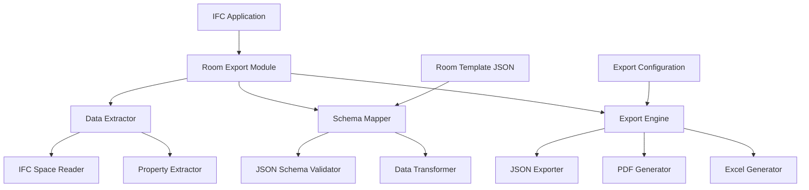

# Design Document

## Overview

The room schedule export system is designed as a module within an existing IFC-based application that extracts room data from IFC Spaces and exports it to structured room schedule formats. The system uses the comprehensive JSON template as the target schema and supports multiple export formats including JSON, PDF, and Excel.

## Architecture

### High-Level Architecture



### Component Responsibilities

- **Data Extractor**: Reads IFC Space data and extracts all available properties
- **Schema Mapper**: Maps IFC data to the room schedule JSON schema with fallback strategies
- **Export Engine**: Generates output files in requested formats (prioritize JSON first)
- **Configuration Manager**: Handles user preferences for export settings
- **UI Controller**: Provides user interface for export configuration and progress monitoring
- **Fallback Handler**: Manages missing data scenarios with intelligent defaults

## Components and Interfaces

### 1. IFC Space Data Extractor

**Purpose**: Extract all relevant data from IFC Space entities

**Interface**:
```python
from typing import List, Dict, Any
from dataclasses import dataclass

class IFCSpaceExtractor:
    def extract_space_data(self, space_guid: str) -> 'RawSpaceData':
        """Extract all data from IFC Space entity"""
        pass
    
    def extract_geometry(self, space_guid: str) -> 'GeometryData':
        """Extract geometry data from space"""
        pass
    
    def extract_properties(self, space_guid: str) -> List['PropertySet']:
        """Extract property sets from space"""
        pass
    
    def extract_related_elements(self, space_guid: str) -> List['RelatedElement']:
        """Extract elements related to space"""
        pass

@dataclass
class RawSpaceData:
    guid: str
    name: str
    long_name: str
    number: str
    geometry: 'GeometryData'
    properties: List['PropertySet']
    related_elements: List['RelatedElement']
    parent_building: str
    parent_storey: str
```

### 2. Room Schema Mapper

**Purpose**: Transform IFC data to match the room schedule JSON schema

**Interface**:
```python
from typing import Optional, Dict, Any

class RoomSchemaMapper:
    def map_to_room_schedule(self, raw_data: RawSpaceData) -> 'RoomScheduleData':
        """Transform IFC data to room schedule schema"""
        pass
    
    def validate_schema(self, data: 'RoomScheduleData') -> 'ValidationResult':
        """Validate data against room schedule schema"""
        pass
    
    def fill_defaults(self, data: Dict[str, Any]) -> 'RoomScheduleData':
        """Fill missing fields with default values"""
        pass
    
    def apply_fallback_strategies(self, data: RawSpaceData) -> 'RoomScheduleData':
        """Apply intelligent fallback for missing data"""
        pass
    
    def generate_missing_data_report(self, data: 'RoomScheduleData') -> 'MissingDataReport':
        """Generate report of missing or estimated data"""
        pass

@dataclass
class RoomScheduleData:
    meta: 'MetaData'
    identification: 'IdentificationData'
    ifc: 'IFCData'
    classification: 'ClassificationData'
    geometry: 'GeometryData'
    performance_requirements: 'PerformanceRequirements'
    finishes: 'FinishesData'
    openings: 'OpeningsData'
    fixtures_and_equipment: List['FixtureData']
    hse_and_accessibility: 'HSEData'
    environment: 'EnvironmentData'
    tolerances_and_quality: 'QualityData'
    qa_qc: 'QAQCData'
    interfaces: 'InterfaceData'
    logistics_and_site: 'LogisticsData'
    commissioning: 'CommissioningData'
    attachments: List['AttachmentData']
    notes: str
    deviations: List['DeviationData']
    links: 'LinkData'
    catalogs: 'CatalogData'
```

### 3. Export Configuration Manager

**Purpose**: Handle user preferences and export settings

**Interface**:
```python
from enum import Enum
from typing import List

class ExportFormat(Enum):
    JSON = "json"
    PDF = "pdf" 
    EXCEL = "excel"

class ValidationLevel(Enum):
    STRICT = "strict"
    LENIENT = "lenient"
    NONE = "none"

class Phase(Enum):
    CORE = "core"
    ADVANCED = "advanced"
    PRODUCTION = "production"

class FallbackStrategy(Enum):
    STRICT = "strict"
    INTELLIGENT = "intelligent"
    PERMISSIVE = "permissive"

@dataclass
class ExportConfiguration:
    format: ExportFormat
    included_sections: List[str]
    output_path: str
    template_settings: 'TemplateSettings'
    validation_level: ValidationLevel
    phase: Phase
    fallback_strategy: FallbackStrategy

class ConfigurationManager:
    def load_configuration(self) -> ExportConfiguration:
        """Load export configuration from file"""
        pass
    
    def save_configuration(self, config: ExportConfiguration) -> None:
        """Save export configuration to file"""
        pass
    
    def get_default_configuration(self) -> ExportConfiguration:
        """Get default export configuration"""
        pass
    
    def validate_configuration(self, config: ExportConfiguration) -> bool:
        """Validate export configuration"""
        pass
```

### 4. Multi-Format Export Engine

**Purpose**: Generate output files in different formats

**Interface**:
```python
@dataclass
class ExportResult:
    success: bool
    file_paths: List[str]
    errors: List['ExportError']
    warnings: List['ExportWarning']

class ExportEngine:
    def export_to_json(self, data: List[RoomScheduleData], config: ExportConfiguration) -> ExportResult:
        """Export room schedule data to JSON format"""
        pass
    
    def export_to_pdf(self, data: List[RoomScheduleData], config: ExportConfiguration) -> ExportResult:
        """Export room schedule data to PDF format"""
        pass
    
    def export_to_excel(self, data: List[RoomScheduleData], config: ExportConfiguration) -> ExportResult:
        """Export room schedule data to Excel format"""
        pass
```

## Data Models

### Core Data Flow

1. **IFC Space Selection**: User selects one or more IFC Spaces for export
2. **Data Extraction**: System extracts all available data from selected spaces
3. **Schema Mapping**: Raw IFC data is mapped to room schedule schema
4. **Validation**: Data is validated against schema and Norwegian standards
5. **Export Generation**: Final files are generated in requested format(s)

### Property Mapping Strategy

The system uses a configurable mapping strategy to transform IFC properties to room schedule fields:

```python
from typing import Callable, Optional, Any

@dataclass
class PropertyMapping:
    ifc_property_name: str
    room_schedule_field: str
    transformer: Optional[Callable[[Any], Any]] = None
    validator: Optional[Callable[[Any], bool]] = None
    required: bool = False

# Example mappings
PROPERTY_MAPPINGS = [
    PropertyMapping(
        ifc_property_name="Pset_SpaceCommon.NetFloorArea",
        room_schedule_field="geometry.area_nett_m2",
        transformer=lambda value: float(value),
        validator=lambda value: value > 0,
        required=True
    ),
    PropertyMapping(
        ifc_property_name="Pset_SpaceFireSafetyRequirements.FireRating",
        room_schedule_field="performance_requirements.fire.fire_class",
        required=False
    )
]
```

## Error Handling

### Validation Levels

1. **Strict**: All required fields must be present and valid
2. **Lenient**: Missing non-critical fields are allowed with warnings
3. **None**: Export proceeds with all available data

### Error Categories

- **Missing IFC Data**: When required IFC properties are not available
- **Schema Validation**: When data doesn't match the room schedule schema
- **Standard Compliance**: When data doesn't meet Norwegian building standards
- **Export Errors**: When file generation fails

## Testing Strategy

### Test Data Examples
- **Complete IFC Space**: Full property sets with all required data
- **Minimal IFC Space**: Basic space with minimal properties for fallback testing
- **Missing Geometry**: Space without area/volume data to test estimation
- **No Equipment**: Space without related elements for equipment-free rooms
- **Mixed Quality**: Dataset with varying data completeness levels

### Unit Testing
- Test each component in isolation
- Mock IFC data for consistent testing using example datasets above
- Validate schema mapping accuracy with edge cases
- Test export format generation with incomplete data
- Test fallback strategies with missing data scenarios

### Integration Testing
- Test complete export workflow with phased implementation
- Validate with real IFC files from different authoring tools
- Test multiple space selection with varying data quality
- Verify output file integrity across all supported formats

### Validation Testing
- Test against Norwegian standards (NS 3420, NS 8175, TEK17)
- Validate JSON schema compliance with partial data
- Test edge cases and missing data scenarios extensively
- Performance testing with large datasets and batch processing
- User acceptance testing for UI components

## Performance Considerations

### Optimization Strategies
- Batch processing for multiple spaces
- Lazy loading of IFC properties
- Caching of frequently accessed data
- Streaming for large exports

### Memory Management
- Process spaces in chunks for large selections
- Clean up temporary data after export
- Optimize JSON serialization for large datasets

## Security and Compliance

### Data Privacy
- No sensitive data logging
- Secure temporary file handling
- Clean up exported files on request

### Standards Compliance
- Validate against Norwegian building codes
- Ensure IFC standard compliance
- Support for future schema versions

## User Interface Components

### Export Configuration Dialog
- Phase selection (Core/Advanced/Production features)
- Format selection with preview capabilities
- Section filtering with visual checkboxes
- Fallback strategy selection
- Progress indicator for long-running exports

### Data Quality Dashboard
- Visual representation of data completeness per space
- Missing data reports with actionable recommendations
- Export readiness indicators
- Validation results summary

### Export Results View
- Generated file locations and formats
- Export summary with statistics
- Warning and error reports
- Options for re-export with different settings